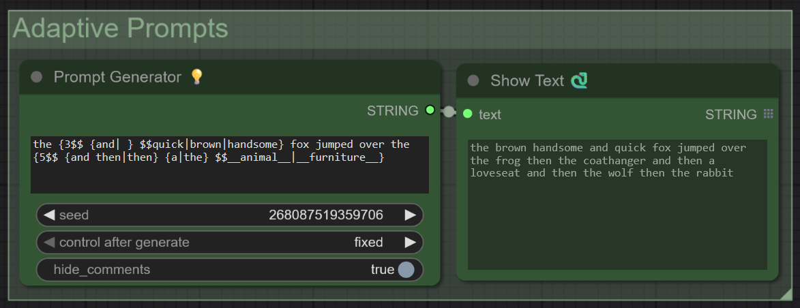
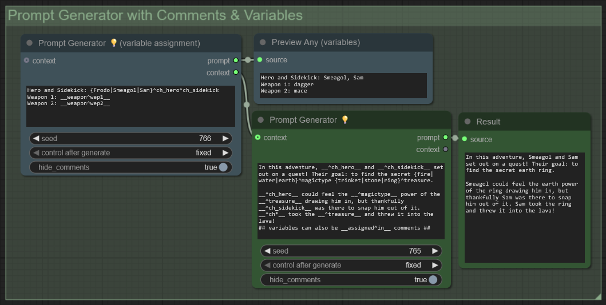
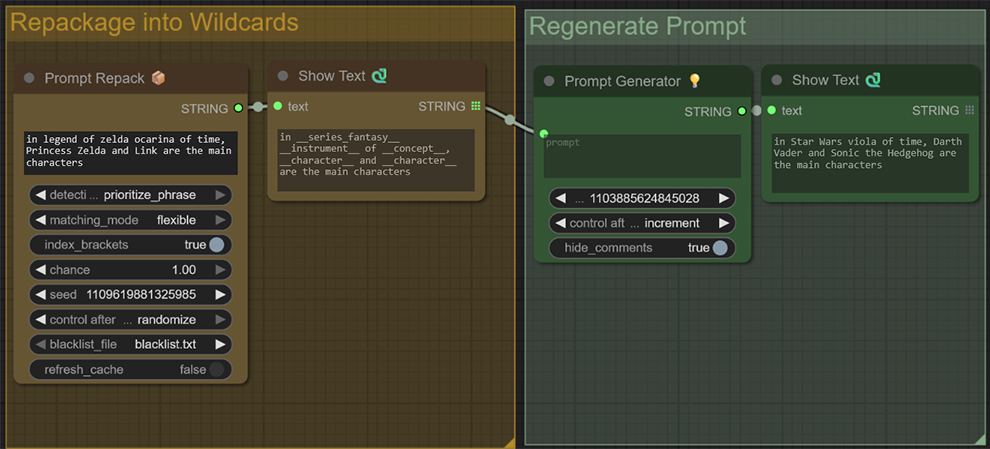
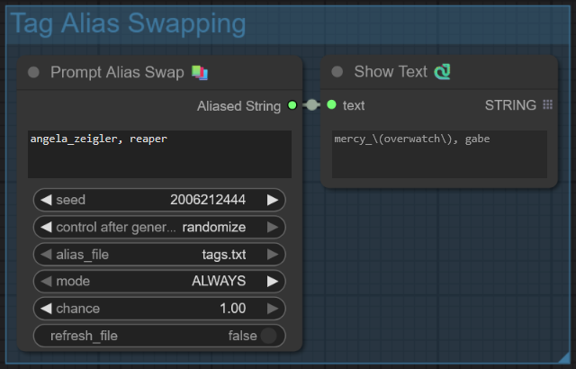
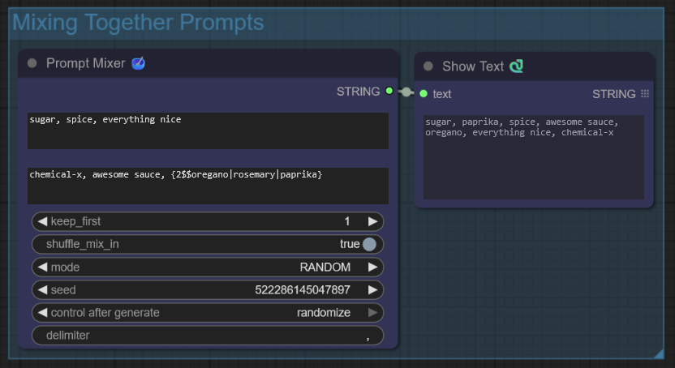
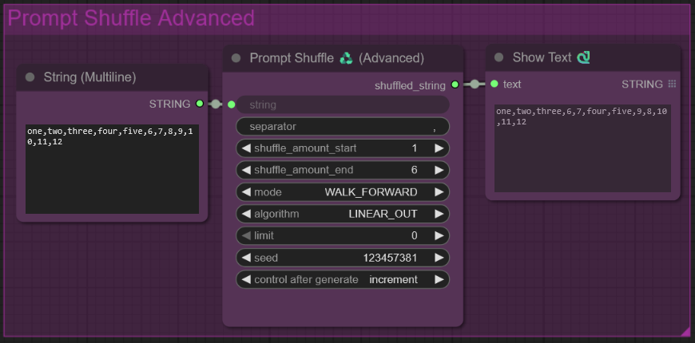
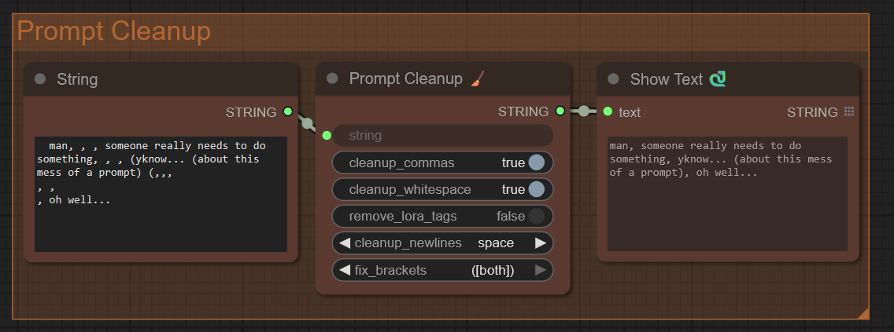

# Adaptive Prompts


> - **06/09/25** Adaptive Prompts Release!
> - **17/08/25** Variables and Comments have been added. All nodes passed main stress-tests. Things are looking good so far!
> - **15/08/25** Established a somewhat working version of these nodes. It's stable enough to use.

## Introduction

**Adaptive Prompts** is a prompt crafting suite. It allows you to randomize, control, shuffle, and even program your prompts. Inspired by the legendary [Dynamic Prompts](https://github.com/adieyal/comfyui-dynamicprompts) by adieyal, which for many people is an essential tool, but hasn't been updated in quite some time.

Think of Adaptive Prompts as a reimagined Dynamic Prompts. You can expect the basic features to work as you know them to. Unless explicitly stated otherwise, from here on out, I will ambiguously refer to this system as { Dynamic | Adaptive } Prompts.


# ⚡ Quick Node Reference 

## Prompt Generation Nodes

These nodes generate new content in your prompt, either by utilizing dynamic prompt syntax, or some other method of generation.

>In these descriptions, a "phrase" can be defined as the space between two commas: *"masterpiece, **this is a phrase**, low quality"*


| Node | Description | Note |
|------|---------|-------|
| 💡 Prompt Generator | Creates dynamic prompts based on your input. Use {brackets} or \_\_wildcards\_\_ | Originally "Random Prompts" |
| 📦 Prompt Repack | A powerful inverse of Prompt Generator. It converts natural words, tags, or phrases back into wildcards. | New/Experimental |
| 🔁 Prompt Replace | Search & Replace, but on steroids. Both inputs support dynamic prompts, then apply procedurally. | New/Experimental |
| 📚 Prompt Alias Swap | Utilizes a tag_alias.txt file, tags separated by commas in this file will be automatically swapped out randomly. | does not currently support .csv  |

## Prompt Processing Nodes
| Node | Description | Note |
|------|---------|-------|
| 🏋️‍♀️ Weight Lifter | Randomly or procedurally applies weights to phrases, "(epic masterpiece:1.105), (highres:0.925)" |  |
| ✂️ Prompt Splitter | Remove or isolates sections of a prompt based on various algorithms. | |
| 🥣 Prompt Mixer | Takes two prompts and mixes them together with a variety of methods. Useful for sprinkling in processed tags/phrases. | Supports Prompt Generation |
| ♻️ Prompt Shuffle | Randomly shuffles phrases with a limit on how many are shuffled. Lightweight and fast. | |
| ♻️ Prompt Shuffle (Advanced) | Utilizes techniques such as walking, rather than arbitrarily shuffling the phrases. Useful for subtle variance. | |
| 🧹 Prompt Cleanup | A very simple multi-tool. Tidies up prompts, such as removing whitespace, extra commas, lora tags, etc. | |

## Utility Nodes
| Node | Description | Note |
|------|---------|-------|
| 🔗 String Append | Combines multiple strings into one using a specified separator. Comes in a 3 and 8 version. | |
| ⛓️‍💥 String Split | Directly splits a prompt into 3 parts to isolate a middle section using start and end. | |
| ⛓️‍💥 Tag Counter | Directly splits a prompt into 3 parts to isolate a middle section using start and end. | |
| 🟰 Normalize Lora Tags | Provides lora weight control by normalizing the values of lora tags. Allowing for flexible inputs. | used w/ Lora Tag Loader |
| 🖼️ SaveImageAndText | Comfy's Image Saver, but saves a .txt file with contents of your choosing. Intended for saving the resulting prompt. | |
| 🌱 Scaled Seed Generator | Deterministically generates 4 random seeds, allowing for frequency offsets for each seed. | |


Combining these various nodes can result in highly creative prompts.

# Dynamic Prompting Quickstart Guide
> *(This does not mention new features, so feel free to skip this section if you're already familiar with dynamic prompts)*
<details>
  <summary><b>Quickstart Guide</b></summary>
  
  
### Basic Example
There are two primary methods to randomize a prompt:

1. **Brackets:** ```{red|green|blue}``` randomly chooses between "red", "green", and "blue"
2. **Wildcards:** ```__fruit__``` chooses a random line from a .txt file called "fruit.txt"

**/wildcards/fruit.txt Example:**
```
# comments can be applied like this
apple
orange
banana

# brackets work here too, effectively making the options less common
{strawberry|blueberry}

# the more options you add, the less likely you'll roll that option
{kiwi|mango|pineapple|pomegranate}

# wildcards can even call other wildcards, allowing for recursion
__fruit_exotic__
```

These two powerful methods can be combined to build very dynamic prompts. Here's a simple example of what can be done:

**Example Input:** ```masterpiece, {2$$__shot__|__canvas__}, __scene_forest__, __quality__```

**Example Output:** ```masterpiece, blue canvas, wideshot, magnificent forest with willow trees with a patch of grass and daffodils, blueberry bush, high-quality, highres```


To see what's going on here, take a look at how dynamic prompts handles unwrapping these nested brackets and wildcards:

**Processing Stage 1:** ```masterpiece, __color__ canvas, wideshot, __adj__ forest with {2-3$$ and $$__plants__|__trees__|__grass__}, high-quality, highres```

**Processing Stage 2:** ```masterpiece, blue canvas, wideshot, __wonderful__ forest with willow trees and a patch of grass and __flowers__, __bush__, high-quality, highres```

Processing Stage 3 is not required because everything has been unwrapped.

Notice how wildcards can be nested within wildcards. It's all up to how you structure your bracket options and wildcards.

Here's an alternate Result Example when using that very same input example: ```masterpiece, closeup shot, pink canvas, excellent shaded forest with cherry-blossom trees, rocks along a cliffside, shaded forest, godrays, gravel path leading to a cave, riverbed, colorgraded, best quality```

### 🔢 Multiple Choices within Brackets
Multiple selections can be made using this syntax:
```
{5$$__fruit__}
{2-4$$__animal__|__color__}
```
Line 1 could be read as instruction: ```pull 5 random lines from fruit.txt```
Line 2 could be read as instruction: ```pull 2 to 4 random lines from animal.txt and bird.txt```

Example Result:
```
apple, mango, kiwi, orange, banana
cat, green, dog
```

If you don't want a comma and space between each selection, you can use your own custom separator using the following syntax:
```
{3-5$$ $$__fruit__}
{3$$ and $$__animal__}
```

Example Result:
```
apple banana kiwi strawberry
sheep and cat and dog
```

### 📁 Wildcard Random Selection and Subfolders

Wildcards can be even more randomized with glob matching by utilizing the * symbol. Here's an example. Say you have the following folder structure within /wildcards/:

```
lighting.txt
lighting_dim.txt
lighting_bright.txt
```

By calling ```__lighting*__``` it will pick one of those three files to draw a prompt from. Furthermore, if you want to bypass the original ```lighting.txt```, you can type ```__lighting_*__``` to ensure that only the two latter are selected. This function can be read as ```select any wildcard in this folder that starts with "lighting_"```

Wildcards can also be be nested in subfolders. ```/wildcards/environments/cave.txt``` can be called with ```__environments/cave__```. One primary advantage of this is that it can help with organization for certain themes. Not only that, using a * expression works here, but restricts to only that folder. ```__environments/*__``` will select *any* wildcard in the /environments/ folder.
Yes, this also means you can use the wildcard ```__*__```. I don't recommend this unless you prefer chaos.

Yes, the possibilities are endless. And these are just the basics of what can be done with dynamic prompts.

> This is the extent of what is currently supported *as of August 16, 2025*.

</details>


# New Features and Nodes


## 💡 Prompt Generator

>Reminder: wildcards must be placed at: ```comfyui-adaptiveprompts/wildcards/```



Formerly known as **Random Prompts**. **Prompt Generator** is the essential node of adaptive prompts.

It works mostly like you remember, but there are a few twists...

### Wildcards Refresh Instantly

No more having to restart ComfyUI every time you make a change to wildcard files.

### Unlimited Bracket Selection
Previously, there was a limit on how many selections you could pull if there are multiple wildcards within a bracket selector
```
{5$$__space__|__land__}    --->   stars, mountain
```
But now, bracket selections will ensure each choice is picked once before looping back around:

```
{5$$__space__|__land__}    --->    stars, mountain, planets, ocean, nebula
```

## Unresolved Wildcard Handling

Your generation no longer throws an error if no wildcard is found.


### Lora tags with "weird__underscores" no longer break syntax

Gone are the days of renaming loras due to double underscores. Dynamic prompts no longer completely derail simply because of an unfortunate naming convention by a lora. So ```<lora:coolest__lora__ever__:1.0>``` will not break things.

Note: Wildcards can still be used to assign the weight of a lora, such as: ```<lora:cool_lora:__random_float__>```

## Wildcard Folder Globbing

Folders can still be accessed via simple globbing techniques:
```
__colors/*__   ---> retrives any file from the /colors/ folder
__colors*__     ---> retrieves from any file that starts with "colors"
__colors__     ---> retrieves from colors.txt
```

## Separator Syntax

Dynamic separators are now possible, by allowing for recursion in that text space. Example:

```{4$$ __and__ $$bob|bertha|benny|bella}``` -> ```bertha with benny and bob plus bella```

Let's say that **and.txt** contains the following:
```
and
with
or
plus
```

Then we use that wildcard as the separator token for a bracket wildcard:
```
{3-4$$ __and__ $$A|B|C|D|E}
```

example outputs:
```
A or E and B
C and D with B or A
B with C and D
```

This opens up possibilities for expanding bracket prompts.

Whitespace can also be used in brackets:
```
{2-3$${,| }$$this|works|too}
```


### ⚖️ Chance Weights

A very simple chance weighting system is included.
It's not very fleshed out right now, and probably buggy as hell. But it gets the job done.
Here's a `chance.txt` wildcard example:

```
# the %% tokens can be placed in front or behind depending on your preference
%80% common
%10% uncommon
rare  # default is 1
ultrarare %0.1%
```

> This feature is experimental and requires testing

### #️⃣ Comments

Comments can be placed inside of prompts. This could be useful to make note of various tags or ideas you want to tinker with.

Input: ```##  Hehehe I'm so sneaky...## Huh, must have been the wind.```

Output: ```Huh, must have been the wind.```

## ⚡Variables

Variables can be assigned and accessed in a few different ways. They can even be accessed from within wildcards. They can technically be set within wildcards, but i wouldn't recommend it due to how the ordering is done.

### ✏️ Variable Assignment 
```
## {variables|can|be|assigned|like|this}^alpha ##
## or can be assigned like this: __character^awesome__ ##

Note: the comment blocks not only prevent the resulting text from being included in the output,
but ensure they are calculated before the rest of the prompt is executed.
this is technically a limitation, but also a feature. you can run it without the comment blocks, but variable retrievals might return nothing.
```

### 🔍 Variable Retrieval
```
Now that we've initialized our variables, we can retrieve them like this:
__^alpha__, __^awesome__,
we can use glob matching with * since they both start with the letter 'a':
__^a*__
We could even randomly retrieve any assigned variable in this prompt instance:
__^*__
With this in mind, clever variable naming conventions could go a long way.
```


### 🔗 Linked Variables
If you so desire, you can assign multiple values to the same variable. Retrieving them allows for further randomization.
```
First, assign the variables:
__character^x__
__color^x__
__fruit^x__

Now calling that variable will retrieve one of the results randomly:
{3$$__^x__}
Example Output: Yellow, Kermit, Apple
```

### 💎 Unique Variables
You can ensure unique variables in one go *(currently only supported by bracket wildcards)*
```
You can assign multiple variables which are guaranteed to have unique results:
{calvin|braxis|celia|deku|esther}^char1^char2^char3

By doing this, we now have 3 variables each with unique assignments!
For example:
__^char1__ = celia
__^char2__ = deku
__^char3__ = calvin

Great for randomized story/scenario prompts.
```

> **Important:** When assigning variables, I strongly recommend placing them in a ```## comment space like this ##```. This is because the Prompt Generator seeks out comment lines and executes the brackets/wildcards in there first. If you don't do this, things might work, but depending on the complexity of your prompt, you variable retrievals might yield null.

Using all of these tricks, you can achieve some pretty powerful results!





## 📦 Prompt Repack


Prompt Repack is an experimental node which can be thought of as the inverse of Prompt Generation. It encapsulates keywords with a wildcard file they exist in. This allows for semantic driven dynamic prompting and even more brainstorming.

A good example of how powerful this system can be is the word "chicken". It belongs to both ```__animal__``` and ```__food__``` wildcards. This can lead to some pretty creative results when rewrapping it.

Prompt Repack has the following modes. In order to explain them, keep this context in mind: ```, this is a phrase and this_is_a_tag, ...```

This node allows you to write with natural language, then wrapping it in a dynamic and creative way. It is also a way to add more creativity and dynamics to your existing prompts.

Many users have wildcards for everything, even simple phrasing. I personally have an ```__and__``` wildcard which I use as a separator token. However, when utilizing Prompt Rewrap, every instance of the word "and" gets caught up in the Repack process.

That's where the blacklist.txt file comes into play. This is a list of words or wildcards you want this system to ignore. See ```comfyui-adaptiveprompts/repack_files/blacklist.txt``` for examples.


**Current Limitations (as of 18/08/2025)**: It currently only supports drawing a wildcard if the matched phrase/word equals the line in the wildcard file. In other words: provide the string: ```harry_potter and luke_skywalker```
```
# /wildcards/character.txt
luke_skywalker
{harry_potter|ron_weasly}
```
The result would be: ```harry_potter and __character__```
This is planned to be fixed.

>**Warning:** If you have wildcards with extremely long names,

> Note: Prompt Rewrap pre-caches for faster lookups on startup. So if changes are made to wildcards, you'll have to restart ComfyUI.


## 🔁 Prompt Replace


Acts as a standard String Replace function, with a twist. The search string and replace string both accept wildcards.

**String** - The input string to process
```
the quick brown fox jumped over the lazy dog
```

**Search** - performs multiple searches, and new lines will act as additional replace strings:
```
fox
dog
```

**Replace** - calculates dynamic prompts for each replacement action, this can be brackets or wildcards
```
{1-2$$ and $$__animal__}
```

Example Result:
```
the quick brown cow and pig jumped over the lazy cat
```


  - Can be used as a regular Search and Replace
  - Allows for multi-line inputs for searching, allowing for many different keywords to be swapped out in one go.


## 📚 Prompt Alias Swap



This node swaps out similar keywords based on an alias text file. It considers swapping out that tag with its alias. This can be useful for shorthand prompting.

This is intended to be used with "alias.cvs" files. Paste its contents into an alias.txt file.

That folder can be located at:
```comfyui-adaptiveprompts/tag_alias_files/```

If you wish to set these files up manually:
```
kermit, kermit_the_frog, kermit_\(the_muppets\)
masterpiece, epic_masterpiece, absurd_masterpiece
```

It utilizes two modes:
- **ALWAYS** - If a tag can be swapped, it will always be swapped.
- **RANDOM** - Has a chance of re-rolling the alias that triggered it, leaving it unchanged.


Note: Unlike Prompt Repack, this feature does *not* support whitespace of any kind. It is intended to work with booru styled tags.

## 🏋️‍♀️ Weight Lifter


Weight Lifter is an experimental node which can shuffles the weights in your prompt.

 ```
 this text is not strong, it is weak, it needs srs gainz
 ```

 ```
 (this text is not strong:1.08), (it is weak:1.16), (it needs srs gainz:1.27)
 ```


You can choose the behavior of existing tags, whether or not to preserve them, or modify them.

Using ```keyword_selection```, the inputs of this field (separated by commas), will act as a filter. If *any* of these keywords exist in the prompt to any extent, it will amplify the entire phrase.

This filter can be set to:
ONLY - Variation is only applied to the selected phrases.
IGNORE - Variation is applied to everything except the selected phrases.
BOOST - Amplifies the selected phases, everything else gets standard variation
SUPPRESS - Minimizes the selected phases, everything else gets standard variation

This can be useful for applying subtle emphasis or de-emphasis weighting to your prompt.

> Note: This feature is still being developed. Please try out some of it's parameters. It could absolutely be better, so feedback is welcome.

## 🥣 Prompt Mixer


**Prompt Mixer** is a versatile node that takes two prompts: a base prompt and a mix-in prompt, and blends them together using different strategies. It’s especially useful for combining tag sets, sprinkling variations into existing prompts, or making final adjustments to an existing prompt.

>Note: The mix-in string supports dynamic prompting.


# 🛠️ Extra Utilities

These are simple but useful nodes that can apply to most comfy workflow, and can serve as powerful post-processing nodes for adaptive prompts.

## ♻️ **Prompt Shuffle**
  - A very simple shuffler which can randomize ordering of a prompt.
  - Unlike the advanced version, the ```limit``` parameter limits the number of tags output.
## ♻️ **Prompt Shuffle (Advanced)**



  - Similar function as above, but utilizes logic to shuffle the tags, which helps greatly with the decaying emphasis nature of prompts.
  - WALK allows tags to travel per action, utilize decay, and many other things.
## 🧹 **Prompt Cleanup**


A simple prompt swiss-army knife. Sometimes, dynamic prompts get messy. This little guy can help clean them up.
  - Can remove excess commas
  - Can remove excess whitespace
  - Can remove lora tags that may have slipped by other processors.
  - Can remove remove stray parenthesis, square brackets, or both.
  - Can replace newlines with space or commas
## 🟰 **Normalize Lora Tags**
  - Worry less about the oversaturation of lora tags with this node which helps normalize the values automatically.
  - Positive and Negative values can be assigned independently or combined.
  - Lora Tag Parser. I recommend: [Lora Tag Loader by badjeff](https://github.com/badjeff/comfyui_lora_tag_loader)
## **String Merger**
  - A lightweight merger for strings
  - Has a (4) version and a (12) version
  - Combines strings separated with a new-line.


# 💡 Tricks & Tips


## Randomized Lora Weights
A neat trick i've been using for awhile is placing a weighted wildcard as the weight of a lora. ```<lora:cool_lora:__weight__>``` Like this. This is a useful way to establish randomized lora weights.
This works well if you're using [Lora Tag Loader](#Links).
And it works even better now with the Normalize Lora Tags node.

rlow.txt:
```
# Random Low Weights
0.05
0.1
0.15
0.2
0.25
0.3
```

Then I run this through the prompt generator:
```
<lora:funny_dog:__rlow__>
```
This allows for wildcards and prompts to handle loras for you.
Consider combining this with the Lora Tag Normalizer.


# Links

  ### [🐍 Custom Scripts by pythongosssss](https://github.com/pythongosssss/ComfyUI-Custom-Scripts)
  Provides a handful of useful nodes. Honestly, a must-have. These are ones I use often:
  - Show Text (simple and practically essential)
  - String Function (for appending or replacing strings)
  - Image Feed (for displaying results)
  ### [Lora Tag Loader by badjeff](https://github.com/badjeff/comfyui_lora_tag_loader)
  This loads loras using the classic ```<lora:sharpness_enhancer:1.0>``` syntax, providing a model and clip node, as well as preserving the string. Works excellently with dynamic prompts.

# Installation

Install like any other ComfyUI Node pack, dropping it into:
 ```/ComfyUI/custom_nodes/```

## Disclaimers

This project took me awhile. If you have any optimizations or suggestions, please feel free to contribute by creating a new issue.

I have no plans to adapt this to any other UI, as dynamic-prompts for A1111. It didn't need it. It's far more efficient and useful than ComfyUI's implementation.

---

*With great power comes great responsibility*


---

Created by **Alectriciti** ⚡ | 🎵 [Listen to my music](https://open.spotify.com/artist/1gjzBsWjtl4yBmVYWB8vbc) 